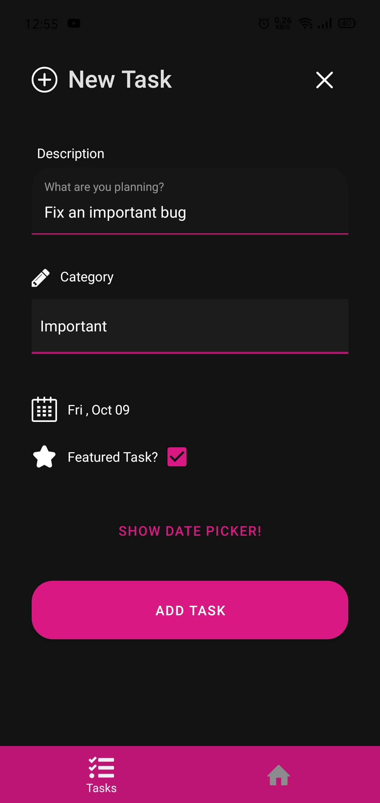
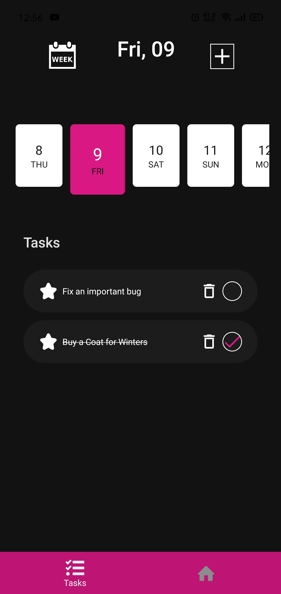
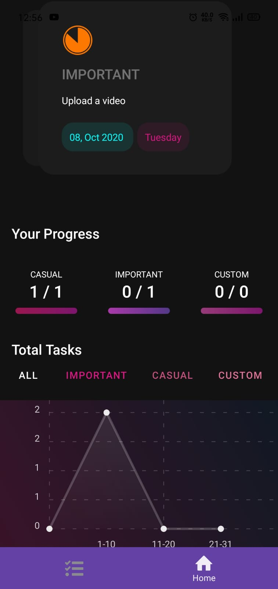

# MovieMania

Discover your favourite movies and track them using MovieMania.



# Technologies Used

- React Native
- Async Storage
- Axios
- Expo-cli
- React Native Reanimated
- React Navigation v5
- React Native Paper
- Material Design

# Run Instructions

## Before Run

```bash
git clone https://github.com/Umernasirr/todoAnalytics-RN.git
cd todoAnalytics-RN && npm install 
```

## To run the application

After navigating to the base directory

```bash
expo start
```

# Screenshots

### Tasks screen of the Todo Analytics App

<br/>

<br/>
<br/>

### Adding a new task into the application  


<br/>
<br/>

### The Analyrics of the tasks via graphs and stats

<br/>



